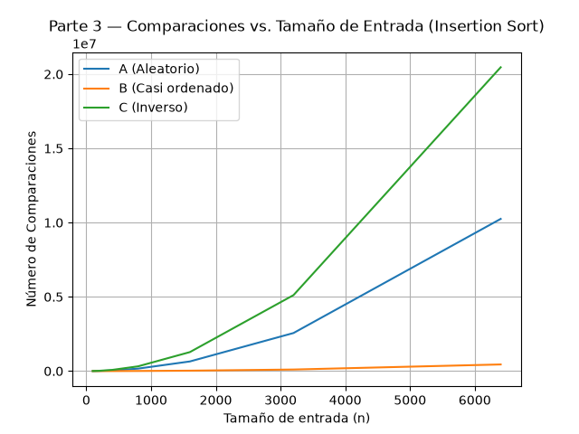
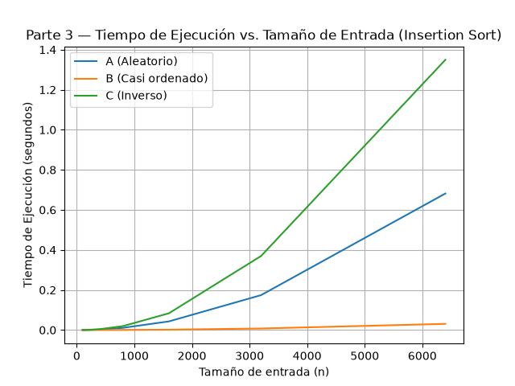

# Laboratorio evaluativo 01 — Fundamentos, complejidad y recurrencias
#### Estudiante: Carla Juliana Giraldo Camacho
---
### Instrucciones para reproducir el experimento:
---
### Parte 1
#### La Secretaría está por firmar la compra de un servidor del doble de velocidad para que el proceso de Tamiza quepa en la ventana de cuatro horas. 
#### ¿Por qué debe analizarse primero el algoritmo, si el que está en producción lleva ocho años entregando el resultado correcto?
La Secretaría de Salud utilizando el software actual Tamiza, cumplen con la corrección: un algoritmo que ordene los casos de mayor a menor riesgo, pero, no cumple con la eficiencia temporal requerida de 4 horas. Es decir, la corrección garantiza el resultado, pero es totalmente aparte de los recursos computacionales y del tiempo necesarios para llegar a este.

La restricción que se incumple es la latencia máxima de ejecución de cuatro horas que nos mencionan tiene el sistema para cumplir su tarea. Y el duplicar la velocidad del servidor no resuelve el problema de fondo debido a que el crecimiento del tiempo de ejecución según la cantidad de datos es cuadrático. Por lo que, a pesar de que sea posible que aliviane (así sea mínimo) el problema, no es una solución que se mantenga a largo plazo. 

Para entenderlo mejor, si se duplica la velocidad es un factor de 2X, lo cual es un comportamiento lineal y es mucho menor al crecimiento cuadrático. 

Por ejemplo, un banco que adquiere los clientes de su competencia por compra de la misma (Banco de Bogotá e Itaú). La cantidad de clientes aumenta debido a la migración en aproximadamente 267.000 usuarios, con un promedio de depósitos totales de COP$4,1 billones.

Durante el cierre bancario nocturno, el sistema ejecuta un proceso para validar que no existan transacciones duplicadas o fraudulentas. Entonces, compara cada transacción contra el resto mediante un algoritmo de búsqueda y la restricción del sistema es una ventana de tiempo de 1:00am a 4:00am (3 horas) antes de reabrir las consultas.

Aunque se cumpla la identificación de duplicados y fraudes, comparar un promedio de 1'335.000 de registros más que en el pasado resulta en un incumplimiento de la ventana de tiempo que anteriormente servía. Lo que podría dejar la aplicación del banco fuera de servicio por más horas.

---
### Parte 2
#### Como responsable técnico de Tamiza, ¿qué responsabilidad ambiental y ética asume al decidir qué algoritmo de ordenamiento se ejecuta cada madrugada sobre los datos de 1.200.000 pacientes?

##### Ambiental:
El tiempo de ejecución del algoritmo se traduce en consumo de energía eléctrica y huella de carbono. En el caso del Insertion Sort (que tiene un Big O(n^2)) procesando 1'200.000 registros, el procesador opera al 100 % de su capacidad durante horas, manteniendo la CPU, los sistemas de refrigeración del centro de datos y la memoria RAM en su mayor demanda energética. Lo que significa que puede mantener un servidor encendido y a máxima carga durante 4 a 8 horas todas las madrugadas del año.

A largo plazo la diferencia entre ejecutarlo contra un algoritmo eficiente representa miles de kilovatios-hora desperdiciados. Y el comprar un servidor del doble de potencia para correrlo empeora la situación, ya que duplica el consumo eléctrico y la demanda de refrigeración, incrementando la huella ecológica de la Secretaría de Salud.

##### Ética:
Si el proceso nocturno no concluye a las 6:00am y el centro de contacto recibe una lista incompleta o desordenada, un paciente con un índice de riesgo alto podría quedar fuera o incluso al final de la lista y ser contactado días después. Un retraso de 24 a 48 horas en un tamizaje cardiovascular puede significar la diferencia entre una atención preventiva a tiempo y un evento grave (como un infarto).

Las consecuencias las asume el paciente, su familia, y el sistema de salud público. El paciente debido al riesgo de deterioro de su salud o muerte, y el sistema de salud costeando una atención a futuro mucho más compleja y costosa.

Si el algoritmo falla en la ordenación, no solo incumple en el tiempo, sino que en la equidad del programa. Un ordenamiento incorrecto perjudica el principio médico de atender primero a quien tiene mayor probabilidad de complicarse. Por esto el equipo técnico tiene la obligación ética de garantizar que el código se ejecute dentro de las 4 horas, y a su vez de verificar que la lógica de ordenamiento respete la prioridad del índice de riesgo.

----
### Parte 3
#### 3.1 - Peor caso, mejor caso y caso promedio
1. Peor caso:

    Es la situación en la que el algoritmo realiza el **mayor** número de operaciones (comparaciones y desplazamientos) sobre el conjunto de datos con tamaño n. 

    Para Insertion Sort, es cuando la lista original está ordenada en sentido inverso al que se quiere obtener (asc o desc).

2. Mejor caso:

    Es la situación en la que el algoritmo realiza el **menor** número de operaciones (comparaciones y desplazamientos) sobre el conjunto de datos con tamaño n. 

    Para Insertion Sort, es cuando la lista original está ordenada en el sentido al que se quiere llegar. En este caso, el algoritmo solo hace comparaciones y no desplazamientos.

3. Caso promedio:

    Es la situación en la que el algoritmo realiza una cantidad **promedio** de operaciones (comparaciones y desplazamientos) sobre el conjunto de datos con tamaño n. 

    Para Insertion Sort, es cuando el orden de la lista de entrada es completamente aleatorio.

##### ¿Cuál de los tres casos usaría para decidir si el algoritmo de Tamiza entra en producción, sabiendo que la ventana de cuatro horas es estricta, y por qué?
Usaría el peor de los casos para realizar las pruebas y decidir si entra en producción, ya que el tiempo de ejecución en el peor caso siempre será el tope máximo que puede alcanzar. Teniendo en cuenta que contamos con una ventana de tiempo estricta para el ordenamiento.

Es decir, si el algortimo es eficiente en el peor caso, entonces también está garantizada su eficiencia en cuaquier otro caso.

##### Predicción de los casos para la situación problema
| Escenario | Predicción | Justificación
|-----|--------|-----
| A - Aleatorio | Caso promedio | Los datos vienen en un oden neutro, sin relación al nivel de riesgo
| B - Casi ordenado | Mejor caso | Es la mayoría de la lista previa (día anterior) que ya está ordenada
| C - Orden inverso | Peor caso | La lista está ordenada al contrario de lo requerido por el centro de contacto (inversa)
#
#### 3.2 — Demostración Experimental de Casos en Insertion Sort

#### Gráficas de Desempeño
| Comparaciones vs. Tamaño (n) | Tiempo de Ejecución vs. Tamaño (n) |
| :---: | :---: |
|  |  |

#### Análisis de resultados y comparación con la predicción
1. Peor Caso (Escenario C — Inverso):

   Presentó la curva cuadrática más pronunciada tanto en número de comparaciones como en tiempo de ejecución.
   
   Coincide con la predicción realizada dado que el lote proviene ordenado de menor a mayor y Tamiza requiere un ordenamiento descendente (de mayor a menor), cada nuevo elemento debe insertarse desplazándose a lo largo de todo el listado ordenado acumulado.

2. Mejor Caso (Escenario B — Casi Ordenado):

   Registró los valores mínimos de tiempo y comparaciones. La curva de crecimiento es casi lineal.
   
   Coincide con la predicción dado que el 98 % del lote ya está ordenado de mayor a menor, el Insertion Sort realiza una sola comparación para cada uno de los elementos y el 2 % restante desordenado al final tiene un uso mínimo que no altera de manera significativa el rendimiento general del caso.

3. Caso Promedio (Escenario A — Aleatorio):

   Se evidencia un comportamiento cuadrático con aproximadamente la mitad de comparaciones e intercambios respecto al Peor Caso.
   
   Coincide con la predicción al no existir una ordenación previa de los datos, la probabilidad de que un elemento se inserte en cualquier posición es constante, requiriendo recorrer en promedio la mitad del listado en cada paso.
